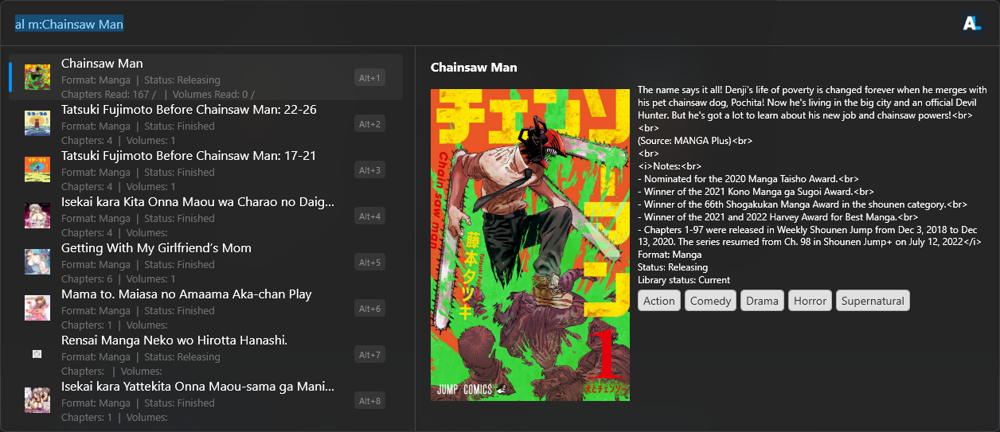
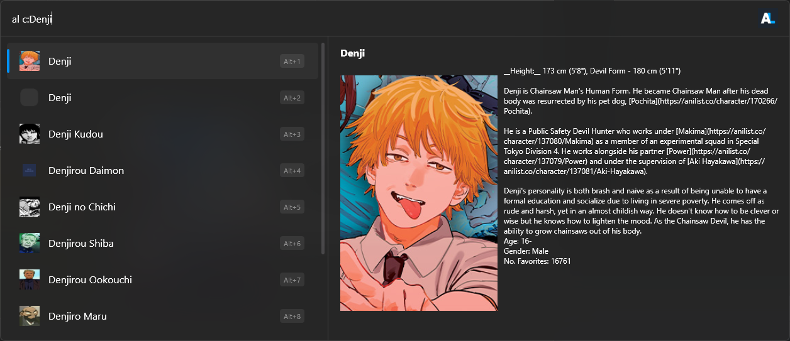

# Flow.Launcher.Plugin.Anilist
An Anilist plugin for FlowLauncher that currently only supports searching

- [x] Searching for Anime
- [x] Adding anime/manga to your list
- [x] Updating anime/manga entries from flow.

Currently working on 
- [ ] Better Error Handling
- [ ] Profile preview and searching for other users
- [ ] More...

This project uses the AnilistNet API Wrapper (https://github.com/dentolos19/AniListNet)

### Search

- To search
  - Manga - use tag `m:` -> `al m:Kagurabachi` (Implemented by [NoPlagiarism](https://github.com/NoPlagiarism 'Awesome programmer'))
  - Anime - use tag `a:` -> `al a:My Hero` (Implemented by [NoPlagiarism](https://github.com/NoPlagiarism 'Awesome programmer'))
  - Using the default media type - search without a tag -> `al My hero`

# Preview
### Anime Search

### Manga Search

### Character Search

